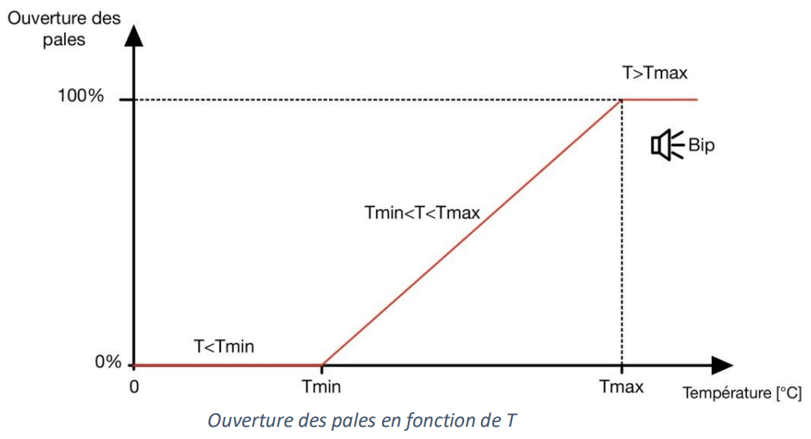

# temperature-controller

This repository has been created for the project of the course "Microcontrôleur" with <a href="https://people.epfl.ch/alexandre.schmid">Prof. Alexandre Schmid</a> in BA4. The purpose of the project build a system using the microcontroller AVR STK300 with a temperature sensor 1-wire and with at least 2 other peripherals. The chosen peripherals in this project are the servo motor Futaba S3003, the LCD display Hitachi44780U 2x16 and a buzzer.

## System description 

For this project, we have developed a device for continuously monitoring the temperature of an environment. It can be used to control blades or a valve to allow a flow of cool air into the desired environment, and to sound an alarm if the temperature is too high. This system can therefore be used to cool a car engine, thanks to the fresh outside air that enters under the case when the car is moving.

  

The user can select a minimum temperature, which corresponds to when the blades are fully closed, and a maximum temperature corresponding to full blade opening. If the temperature between these parameters, the blades open linearly. In addition, if T>Tmax then an alarm sounds to warn that the motor is too hot.

  

## Presentation video

The presentation of this project can be found <a href="https://youtu.be/p2kzhmMfhIk">here</a>.
